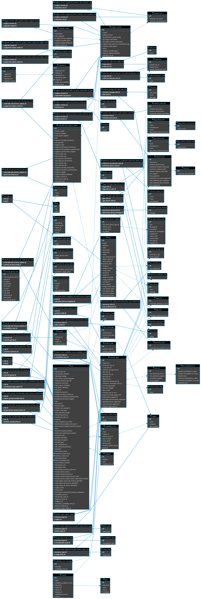

<!-- NEEDS MORE PICTURES/DIAGRAMS -->

Managing your cloud infrastructure with the many ways they can be configured and the interlocking relationships between them maps very cleanly into a database infrastructure. The various cloud entities become rows in tables, the configuration options become columns, the relationships between them represented by joins between tables using foreign keys, and invalid configurations can be prevented in the first place through constraints. This model of the cloud also enables the importing of existing infrastructure into the database, allowing one to go from un-managed to managed infrastructure in seconds.

But we also recognized that we could not produce an accurate model of the entirety of AWS's offerings in one shot, and that we might make mistakes in our modeling, and so focused on an initial subset of functionality with the intention of building it up and fixing it as we encounter edge cases. This is already a solved problem in databases with schema migration systems, or so we thought. But as we built our first prototype, we realized that our prototype was becoming unweildy and off-putting even to us as its creators. It was becoming harder to figure out what you wanted to do to manipulate your cloud and execution time was slowing down. The root cause of both of these was the database schema.

## Our Initial Approach

This is a monstrous schema that is hard to swallow as someone intimately familiar with the details of AWS as we now are, let alone "normal" developers who are just looking to get work done. The confusion comes from multiple dimensions:

1. We tried to stick to [third normal form](https://en.wikipedia.org/wiki/Third_normal_form), which makes the possibility of data corruption effectively nonexistent but splits things that are conceptually a single entity into multiple tables. This was partially done because even today ORM support for [Postgres Array Types](https://www.postgresql.org/docs/9.1/arrays.html) is spotty and this form is equivalent theoretically (but more confusing as a user).
2. We have a mix of mutable tables controlled by the user and "immutable" tables populated by data from AWS itself. This was done for improved guarantees on correctness within the database. For instance there is an AMI table that has all of the AMIs and relevant metadata that you can use to spawn an EC2 instance that is joined into your ec2 instance entity rather than as a regular string that may or may not work. It is confusing because which tables are which kind is not labeled and if you're not interested in these metadata tables they simply take up mental energy to filter through and ignore.
3. Worst of all, in our opinion, is the lack of abstraction possible. You *must* have the entirety of all configuration options for every service on AWS that we support at all times, or no one can ever make such a configuration change. This would be akin to an IaC service requiring that you write code for absolutely every service and provide a default value for every configuration knob of every service, regardless of whether or not you use that service, but to make up for it they "conveniently" provide you a template with all of this filled in for a new AWS account that you just need to edit for your own purposes.

So, is that it? IaSQL is an interesting concept with terrible real-world UX. [Betteridge's law of headlines](https://en.wikipedia.org/wiki/Betteridge's_law_of_headlines) tells us the answer to that rhetorical question is "no." (Obviously. Why else would we be writing an article on IaSQL? ;) )

## The Encapsulation Problem

Tackling these three points in reverse order (as that's what we actually did chronologically and due to prioritization), we'll start with the presence of every single table for every single user whether they use it themselves or not. This is perfectly natural in a "standard" multi-user database situation. Your own product's backend server handles multiple users simultaneously and stores their data within a singular database. Whether or not a user ever uses all tables in that schema is unimportant. They will never see the schema themselves (it is abstracted by your product) while the backend code itself has to handle all of the users and all of their needs so it *does* need to know about all of the tables in the schema. (Regardless of if this is a monorepo or a microservice architecture. All of the microservices *as a whole* interact with all of the tables in all of the schemas *as a whole.*)

But IaSQL differs in two big ways: first, the interface is the database itself, and second, each user has *their own* database to interact with. The assumption that every table has to be in the database for every user does not have to be the case if the IaSQL change engine can be made aware of these differences. The main issue with this is that migration tooling assumes a linear database history, and even if we were to use a database with a branching history like [Dolt](https://www.dolthub.com/) or [PlanetScale](https://planetscale.com/), it's not like we would be able to branch IaSQL's migrations to support security groups and then either EC2 or Fargate, some users would have neither of the two, some one of the two, some both: it's a combinatorial explosion of possibilities. A history-based approach isn't going to cut it.

We immediately recognized parallels with the problem we were having with solutions in other domains. Software development has source includes and module systems, compiled binaries have DLLs, and Unix filesystems have package managers. From these we were able to derive a set of options loosely based on their own solutions to this problem and the compare and contrast them.

* **"Source includes"** refers to C-style `#include "somefile.h"` statements in C source files that literally tells the compiler to copy the contents of that file in place of that line in the source file. We considered this analogous to providing schema migration "snippets" to users that they could insert into their migration system of choice.
* **"Modules"** refers to more modern languages that have a built-in concept of encapsulated code and how to access the exported functionality from other encapsulated modules. This further bifurcates into two camps: module systems with dependency lists (Python, Java, etc) and module systems with dependency trees (Node.js, Rust, etc). The analogous solutions here are collections of schemas that are each incorporated into their own isolated schemas instead of them all being in the default `public` schema, with the tree version having an automatic schema rewriting system to allow different modules to refer to different versions of the same modules they depend on, if needed.
* **"DLLs"** refers to an operating system-provided mechanism to dynamically link pre-existing binary code into your own already-running application following a special, unified API. This is much more strict and requires an ironclad calling contract to be known ahead of time between the DLL provider and the primary executable. We considered the equivalent in the database to be a kind of "meta schema" where there are fixed tables like "Service", "Entity", "EntityOptions", etc that must be populated to describe how to configure the AWS service in question, and then other fixed tables for the user to populate it, with the number of rows equal to the number of arguments needed to be provided to AWS's APIs, essentially.
* **"Package Manager"** refers to existing systems like APT, RPM, Homebrew, etc, that handles the install and uninstall of files (executable or not) within a UNIX-like operating system. We consider this one very similar to a module system with a dependency list, except there is no *real* isolation involved, so it is like that with all of the values placed into the default `public` schema.

We quickly ruled out a DLL-like approach as it was too confusing in the other direction. Hard to find relevant information because *everything* has to be done with complex queries involving multiple joins, self joins, and precise where clauses.

The `#include`-style was seductive because it wouldn't actually require any changes to how a "normal" software engineering team would manage their database, but we noted its error-prone nature in the case of complex relationships between various AWS services (the end user has to figure out which migration snippet to add to their migration system in what order), the lack of control on how fixes/upgrades to the schema would be applied, and the complexity of all of the snippets we would need to generate for the upgrades (each new version would need to have a migration snippet from at least the prior one, but if the prior one was a mistake you would want a way for a version bump from two prior versions, etc). It would *probably* be a quagmire long-term, is what we concluded.

That leaves the three closely-related options of module tree, module list, and package manager style systems. The module tree approach was ruled out early for two big reasons: the schema name rewriting would make it hard to know "which" version of the same package is actually which, but more importantly you can create impossible data scenarios with schema replication like that. If version A of an EC2 module and version B both have a record for an EC2 instance using an `m4.large` machine, and the user edits it to make it a `t2.micro` in version A and edits it to be a `m4.4xlarge` in version B, which edit is the one to apply? What was even intended in this case? (Likely, it would be a confusion of their own thinking they had two instances instead of one running.)

Even if only one was changed there could still be questions on intent, and if certain features are available in one versus another and the code backing the two versions conflicts despite the data not conflicting it could cause issues without any user input at all. A module dependency tree can be the best solution for code, but it's terrible for data.

Finally, while having each module scope its tables into its own schema namespace would eliminate the possibility of collisions, [the majority of ORMs and migration systems do not support multiple schemas simultaneously](https://github.com/prisma/prisma/issues/1122), which would make adoption more difficult. With a metadata table associating table names to module/package names, the difficulties of knowing what tables belong to which is also somewhat mitigated.

## Resolving Immutable Table Confusion

Now that we have picked out the most appropriate pattern to match on, let's see how this affects our other two problems: the mutable and immutable tables, and the single-entity-multiple-tables issue.

The reason why we had the immutable metadata was for two reasons:

1. Allow the users to query useful information out of their infrastructure.
2. Provide stronger correctness guarantees on their infrastructure changes.

The first one is actually not required for *managing* your infrastructure. It's simply a nice-to-have, and there are existing tools in this space. The second point is stronger, but what if someone doesn't want those guarantees if it makes it harder to use? Could we make them optional? It turns out that we can.

Each AWS service we expose as a module has its own migration and revert paths. They *don't* have to be in complete isolation from each other. Like packages in a package manager, an IaSQL module can declare a list of dependencies that it expects to already be in place in the database that it relies on, and create one or more foreign keys into to make the relationship clearer, like EC2 instances having a join table into security groups to allow many-to-many relations between them and get the security rules you've defined to apply as desired.

This can be used for the immutable metadata tables, too. By isolating them into a separate module that depends on the "main" module, you not only make it clearer to the user that they're separate and immutable (by the module name), you can bolt on increased type safety by changing a column into a foreign key on one of the metadata tables when it is installed and reverting it back if uninstalled. Now instead of an EC2 instance's AMI ID being just an opaque string, it can be a string that's joined onto the AMI ID of an AMI table in an `ec2_metadata` module and you can be sure you've got no typos when you try to deploy because the database wouldn't even let you insert the record in the first place if it was wrong.

## ["So Help Me Cobb"](https://en.wikipedia.org/wiki/Third_normal_form#cite_note-Diehr-8)

On sticking to third normal form, we realized that if we loosened up our ORM target a bit to only the most popular ORMs, we can use Postgres Arrays and ActiveRecord, Django, TypeORM, and Prisma, amongst others all support this feature, and so for fields that truly have no place outside of a singular entity and truly should always be created, updated, and deleted in sync, we can switch to that, reducing the number of tables necessary.

Not so much a technical decision as it is a stylistic one, but this approach still gives us the correctness guarantees of the Third-Normal Form while being a bit more compact, if less common. However we believe it has improved the UX of working with these tables to accomplish your actual goal of deploying infrastructure.

## UX of a Package Manager

One last piece that has not been touched on is the user experience of manipulating the IaSQL modules. Just like many modern language package managers have, we took a lot of inspiration from the granddaddy of package managers: `apt`. It has a *lot* of features, but the core bits are installing packages, uninstalling packages, upgrading packages, and listing packages (both remote and already installed).

Installing and uninstalling packages also tends to ask you questions if there are transitive dependencies that also need to be affected.

**INSERT APT INSTALL SCREENSHOT HERE**

At first, we figured we could do it exactly like `apt`, `brew`, etc, and have a CLI application that you install to manage your IaSQL database(s), and [that's what we built](https://github.com/iasql/cli) as we figured it was precisely what was needed since PlanetScale does the same thing. We also wanted the Postgres Database that we're built on top of to be pure and not require any extensions, and so we thought that it would be impossible otherwise, in any case.

But as we used the CLI ourselves, we realized that it really didn't work well for anyone.

* If you're using a migration system yourself (while we can't use one for the modules, your own history of what modules you're using and what changes you're making to your infrastructure is a totally reasonable expectation), few migration systems support a migration that includes a CLI application call (and the ones that do tend to only because their migration system is just code in a general purpose programming language so they can't stop it) so you can't easily, or at all, track the actual module install/uninstall/upgrade calls.
* If you're using IaSQL to manage the infrastructure doing the heavy lifting for your [Jupyter Notebook](https://jupyter.org/) (future blogpost coming!) you have to leave yourself notes in it to execute certain CLI calls at certain times, instead of just having it in your Notebook's code itself.
* If you can't trust AWS's auto-scaling logic and want your application to adjust its own configuration on the fly using IaSQL (also future blogpost!), while it is not impossible it is *very* difficult to have the cli application available to your own application and properly authenticated.

All of these things, as well as the actual execution of your prepared infrastructure changes to your cloud account, pointed us directly at these features being stored procedures to call within the database connection, rather than through a sidecar process. By using a [Postgres-based job queue system, Graphile Worker](https://github.com/graphile/worker) and a trickery with [Postgres' ability to make a query on a remote Postgres server](https://www.postgresql.org/docs/current/contrib-dblink-function.html) to simulate a real nested transaction by remotely calling itself, we were able to port these functions over.

While we cannot interactively prompt users during install/uninstall about modules that are necessary for it to work, we can still provide human-readable messaging on failure, and as a bonus, on success we're able to return a virtual query result that you can select on and revisualize how you desire, which is an improvement over the fixed representation that came out of our CLI.

Now all management of your database outside of the initial setup is done through the database itself, and now *anything* that has a Postgres database client has access to the full power of IaSQL, whether that's your migration system, your [Jupyter Notebook](https://jupyter.org/), your backend application, your frontend via GraphQL and [Postgraphile](https://www.graphile.org/postgraphile/), inside of a SQL IDE like [ArcType](https://www.arctype.com), an internal dashboard on [ReTool](https://retool.com/), and so on.

## Summary

IaSQL became unwieldy and offputting when we treated it like any other backend service with a migration system. By building a package management system for IaSQL, we:

* Reduced the conceptual complexity by only including the tables you need to manage your own infrastructure.
* Reduced the execution time of infrastructure changes by only checking services you actually use.
* Made the "type safety" of IaSQL a grading scale from just simple type checking (string, integer, etc) to incredibly precise with constraints and foreign keys on immutable data from your cloud provider.

By putting the package management system into the database instead of in a CLI application, we:

* Reduced the amount of tooling necessary to learn and set up.
* Increased the scenarios in which managing your IaSQL database is possible.
* Made the results of the operations themsevles queryable 
